# Architecture Diagrams

Rendered (Mermaid) views of the system described in [architecture.md](architecture.md).
Section references (§) point there. GitHub and most IDEs render these natively.

Contents: 1 system overview · 2 ports & adapters · 3–4 Workflows A/B · 5 the gate ·
6 resolution · 7 catalog bootstrap · 8 workspace · 9 estate knowledge & repo config ·
10 QA monitoring/review/release · 11 sharing the test plan · 12 team report ·
13 configuration & estate management.

## 1. System overview (§4.2)

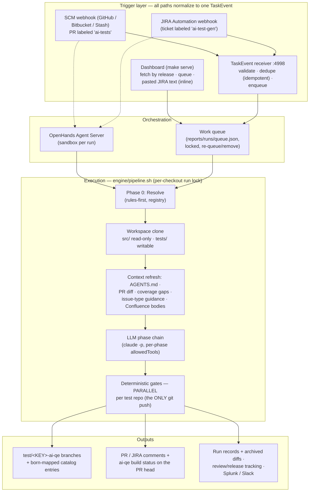

## 2. Ports & adapters — the reusable platform (§5.10)

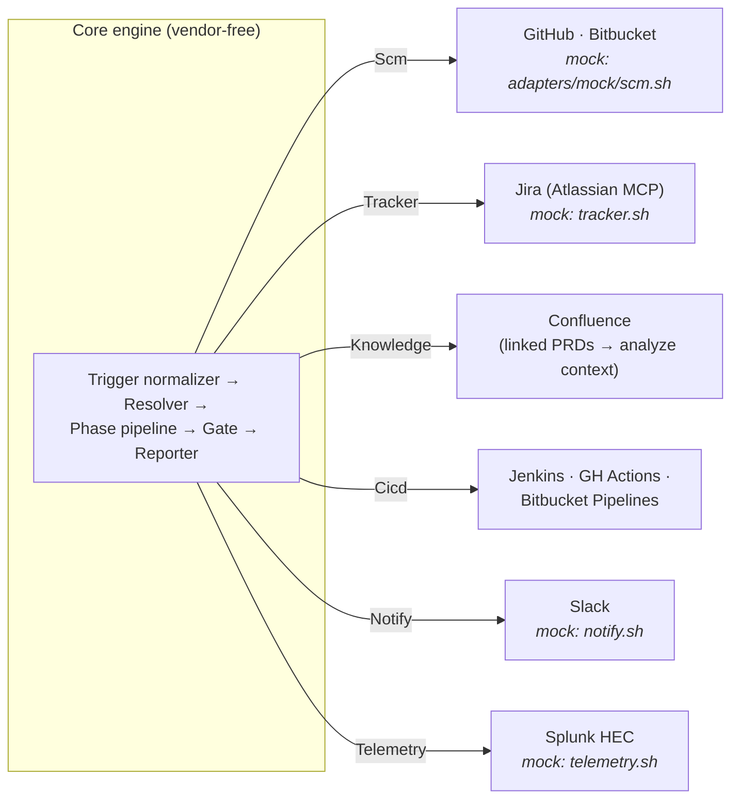

Every adapter — real or mock — answers the same verbs; unknown verbs exit 64
(`make conformance` enforces this). `AIQE_MOCK=1` swaps the whole right-hand column
for mocks without touching the engine.

## 3. Workflow A — PR-triggered test sync (§5.1)

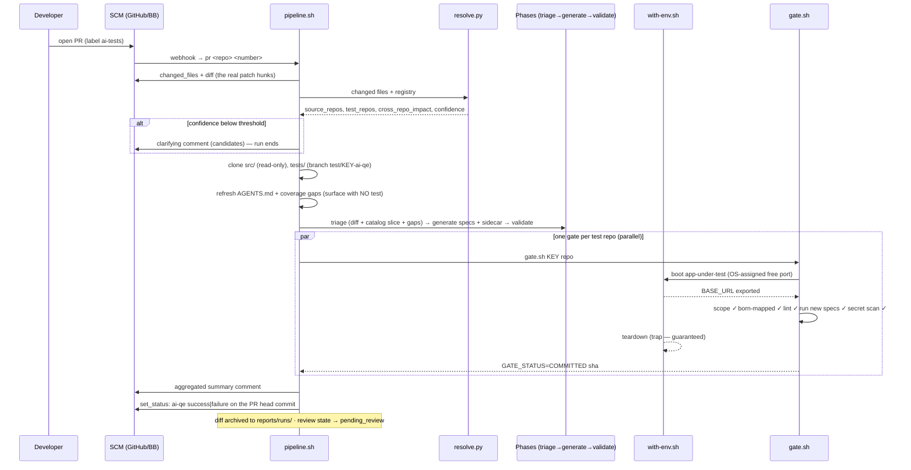

## 4. Workflow B — JIRA-triggered test authoring (§5.2)

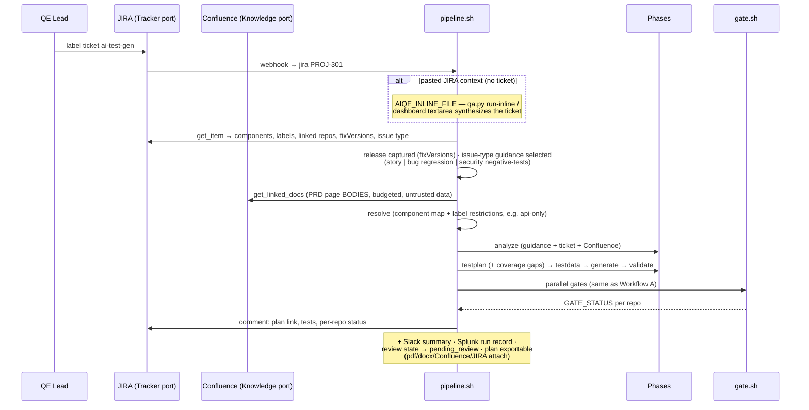

## 5. The deterministic gate (§5.5)

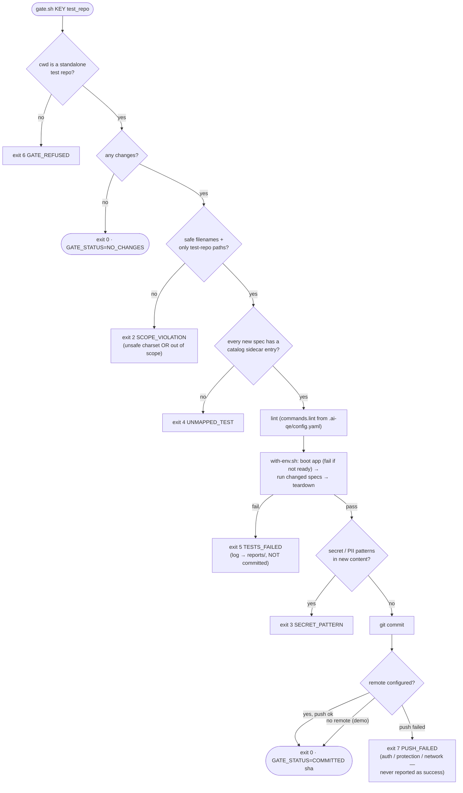

All red paths quarantine the run for human inspection — never auto-retried. The
scope check rejects filenames outside a safe charset **before** any spec name is
interpolated into a shell command (the gate is the deterministic safety boundary).
Codes 2–5 are permanently regression-tested by `make test-gate`.

## 6. Repo resolution — Phase 0 (§5.8.2)

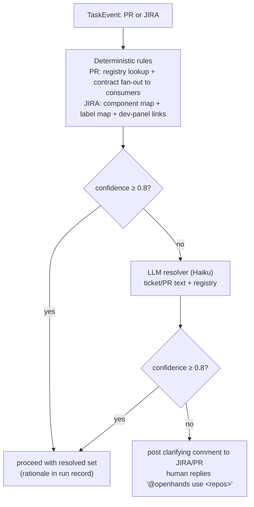

## 7. Catalog bootstrap (§5.9.2)

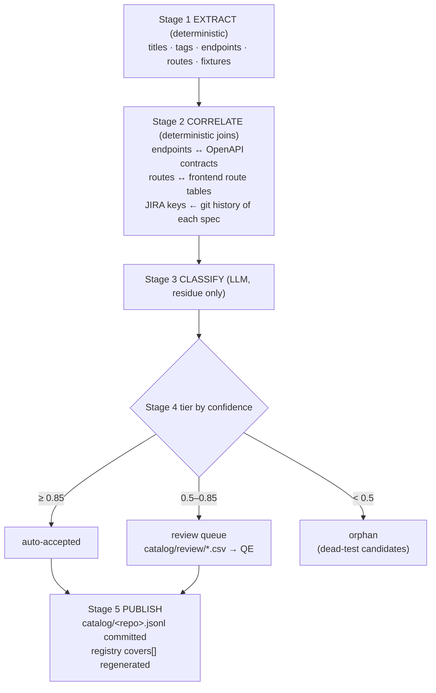

## 8. Workspace layout per run (§5.8.3)

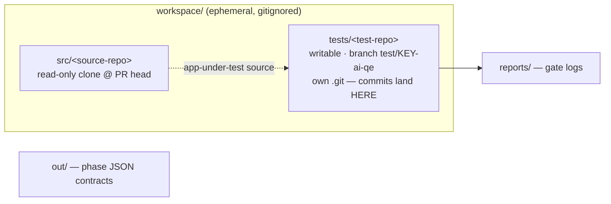

The gate refuses (exit 6) to operate in any directory that resolves to the scaffold's
own repository — workspace clones are always independent git repos.

## 9. Estate knowledge & repository configuration

Every path that changes estate truth regenerates `AGENTS.md`, so LLM phases always
plan and generate against current facts:

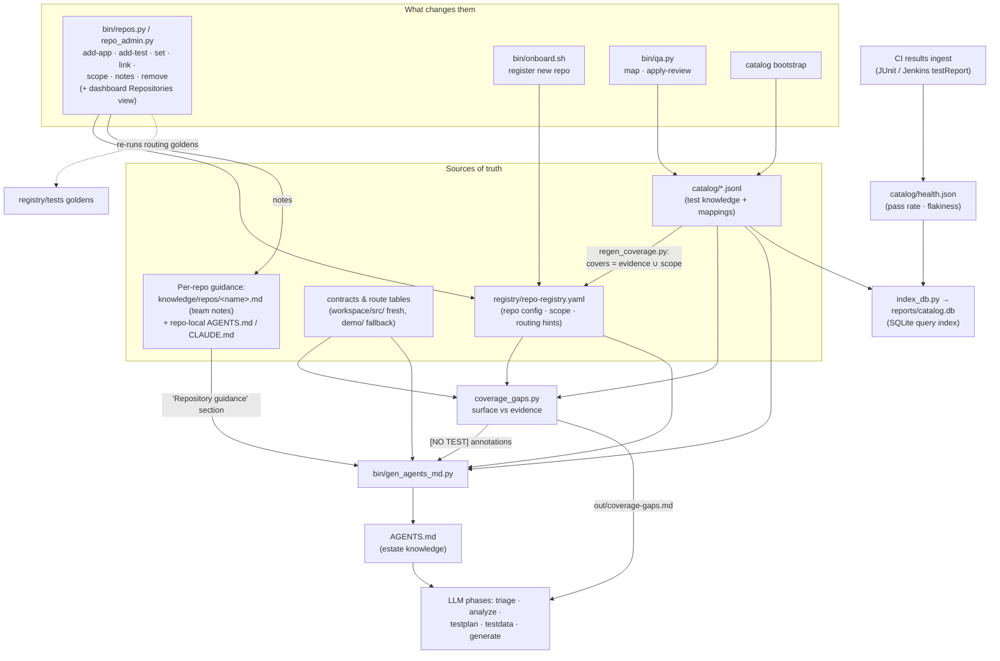

Each E2E test repo carries a hand-managed **scope** (the app repos it is responsible
for — many app repos map to one test repo). `covers[]` stays generated as *catalog
evidence ∪ scope*, so a newly-mapped repo routes immediately, before any test evidence
exists, without ever hand-editing coverage. **Per-repo guidance** — team notes plus any
`AGENTS.md`/`CLAUDE.md` committed inside a repo's own checkout — is merged into
`AGENTS.md` and therefore steers every generation, test-plan, and coverage-gap phase.

## 10. QA monitoring, review & release tracking

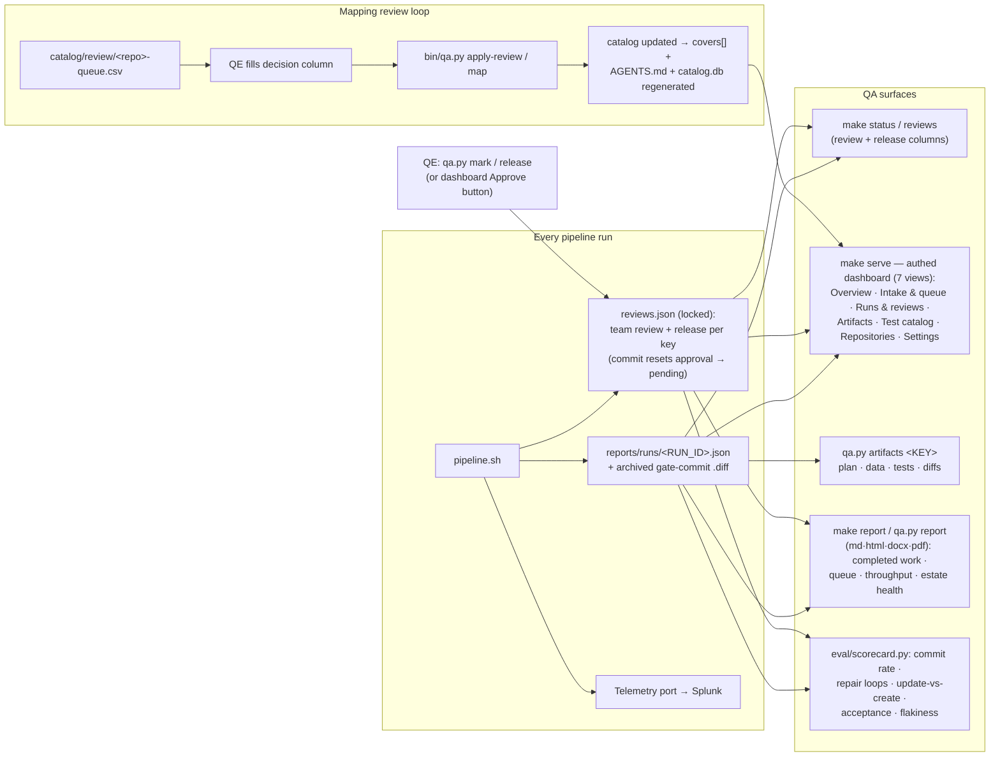

## 11. Sharing the test plan

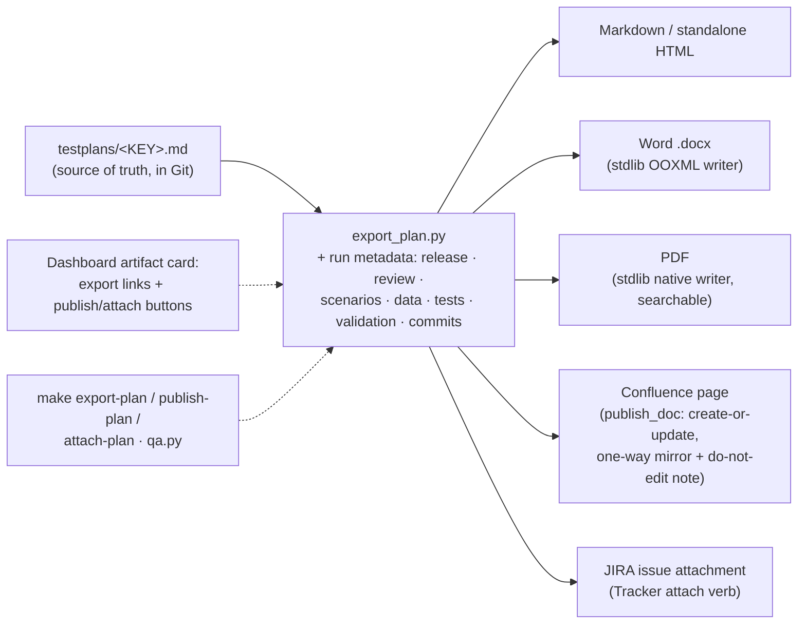

## 12. Team status report

One shareable document — for standups and release readouts — aggregated from state
the platform already keeps. Same stdlib renderers as the test-plan export.

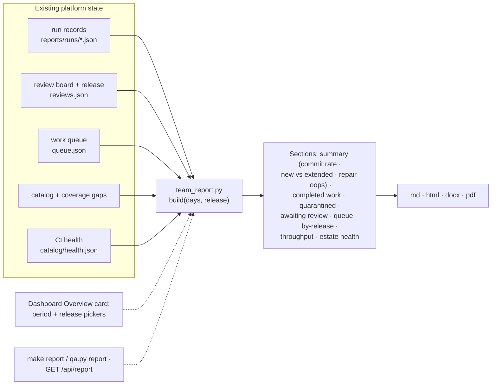

## 13. Configuration & estate management (dashboard)

Everything a QA lead configures lives in two dashboard views (plus CLI parity), so no
YAML or `.env` editing is required.

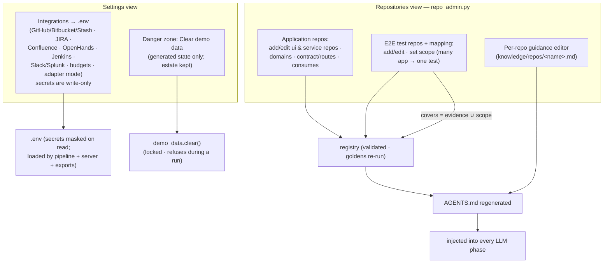
