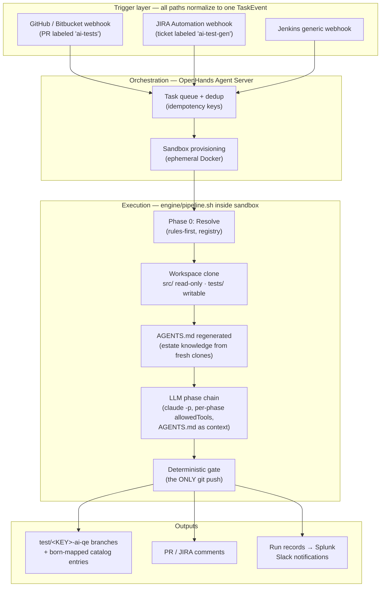
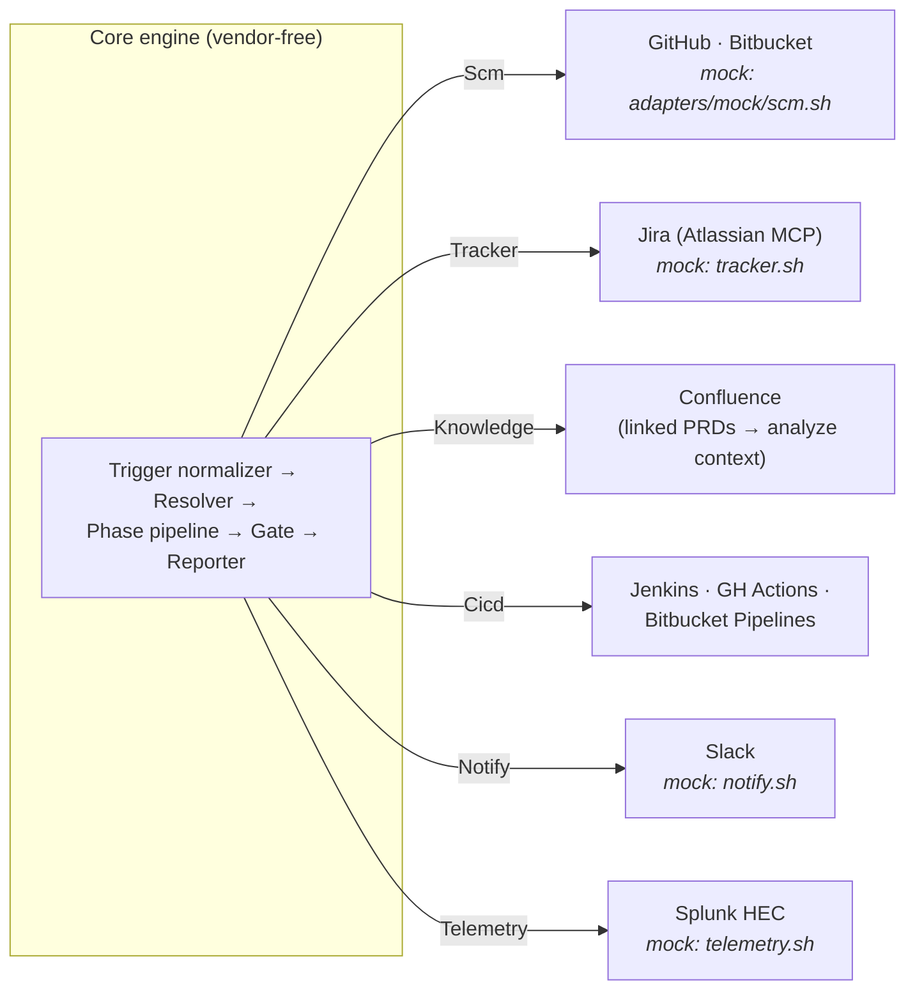
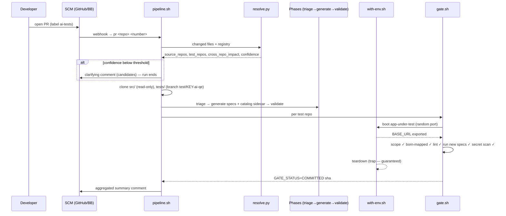
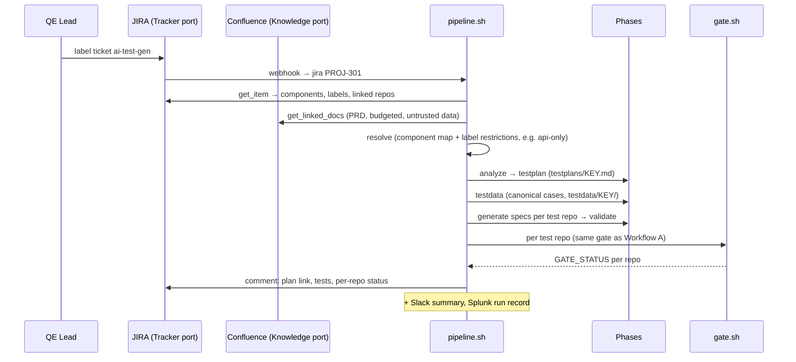
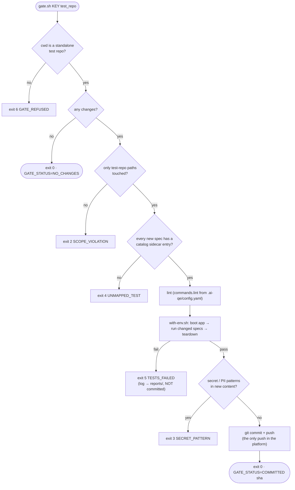
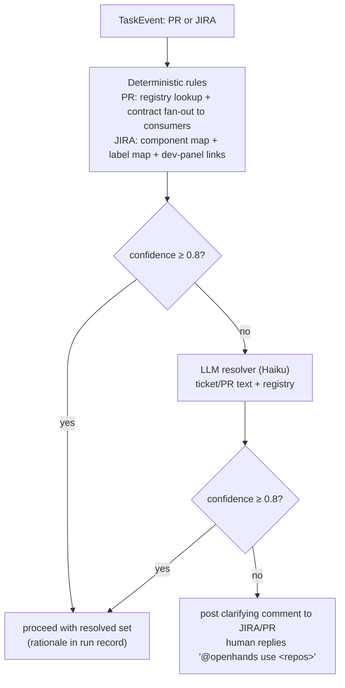
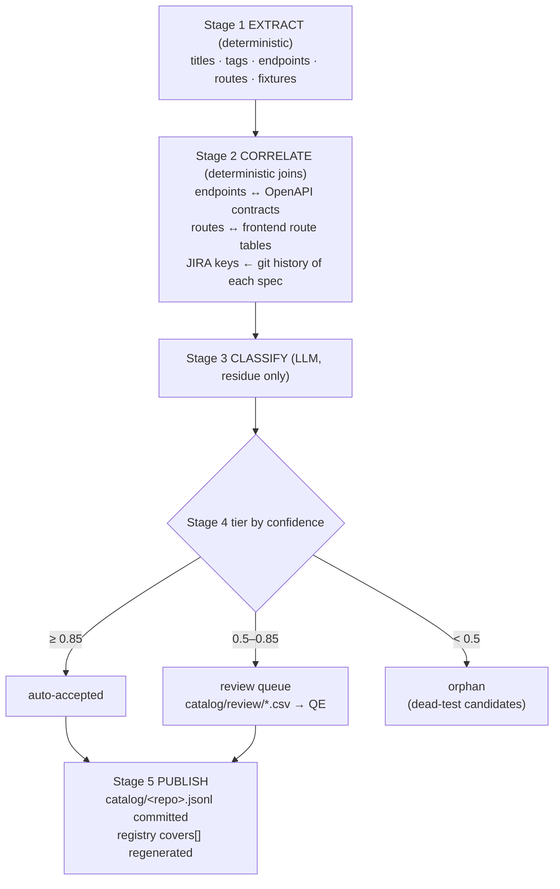
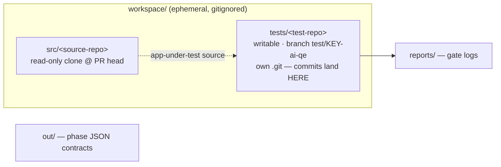
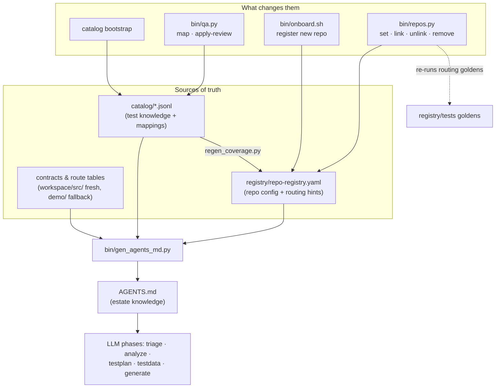
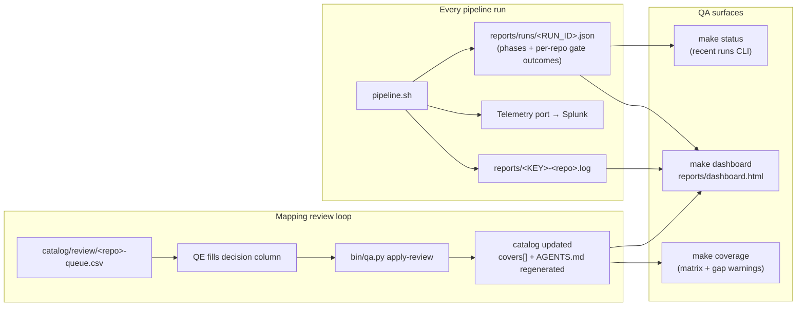

# Architecture Diagrams

Rendered (Mermaid) views of the system described in [architecture.md](architecture.md).
Section references (§) point there. GitHub and most IDEs render these natively.

## 1. System overview (§4.2)

## 2. Ports & adapters — the reusable platform (§5.10)

Every adapter — real or mock — answers the same verbs; unknown verbs exit 64
(`make conformance` enforces this). `AIQE_MOCK=1` swaps the whole right-hand column
for mocks without touching the engine.

## 3. Workflow A — PR-triggered test sync (§5.1)

## 4. Workflow B — JIRA-triggered test authoring (§5.2)

## 5. The deterministic gate (§5.5)

All red paths quarantine the run for human inspection — never auto-retried. Codes 2–5
are permanently regression-tested by `make test-gate`.

## 6. Repo resolution — Phase 0 (§5.8.2)

## 7. Catalog bootstrap (§5.9.2)

## 8. Workspace layout per run (§5.8.3)

The gate refuses (exit 6) to operate in any directory that resolves to the scaffold's
own repository — workspace clones are always independent git repos.

## 9. Estate knowledge & repository configuration

Every path that changes estate truth regenerates `AGENTS.md`, so LLM phases always
plan and generate against current facts:

## 10. QA monitoring & mapping-review loop

