# Architecture Diagrams

Rendered (Mermaid) views of the system described in [architecture.md](architecture.md).
Section references (§) point there. GitHub and most IDEs render these natively.

Contents: 1 system overview · 2 ports & adapters · 3–4 Workflows A/B · 5 the gate ·
6 resolution · 7 catalog bootstrap · 8 workspace · 9 estate knowledge, repo config &
guidance sync · 10 QA monitoring/review/release · 11 sharing the test plan ·
12 team report · 13 configuration & estate management · 14 plan-first approval
workflow · 15 deployment topology.

## 1. System overview (§4.2)

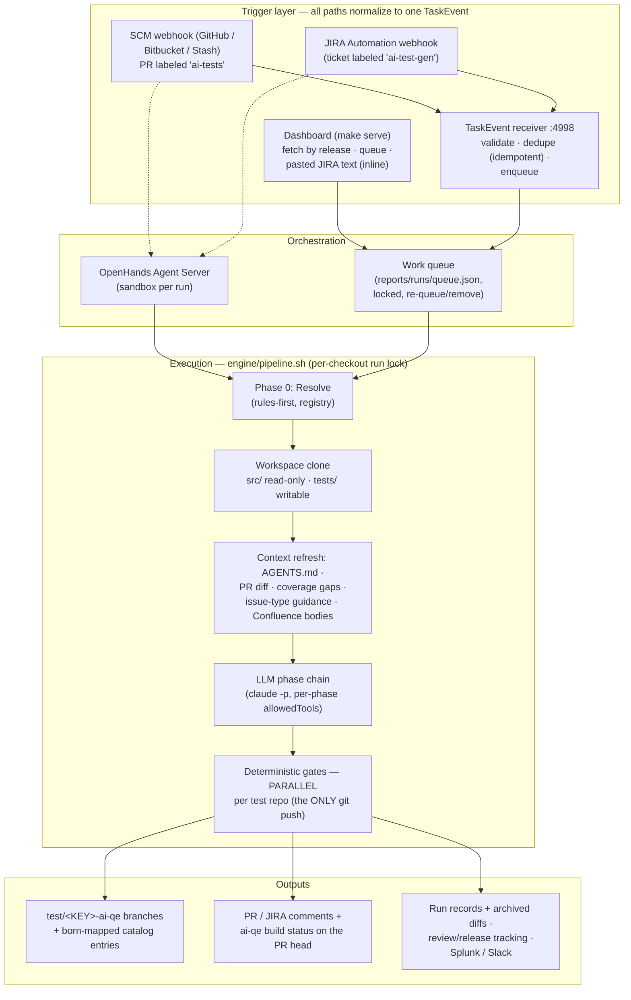
```mermaid
flowchart TB
    subgraph TRIGGERS["Trigger layer — all paths normalize to one TaskEvent"]
        GH["SCM webhook (GitHub /<br/>Bitbucket / Stash)<br/>PR labeled 'ai-tests'"]
        JIRA["JIRA Automation webhook<br/>(ticket labeled 'ai-test-gen')"]
        UI["Dashboard (make serve)<br/>fetch by release · queue ·<br/>pasted JIRA text (inline)"]
        HOOK["TaskEvent receiver :4998<br/>validate · dedupe (idempotent) ·<br/>enqueue"]
    end

    subgraph ORCH["Orchestration"]
        OH["OpenHands Agent Server<br/>(sandbox per run)"]
        WQ["Work queue<br/>(reports/runs/queue.json,<br/>locked, re-queue/remove)"]
    end

    subgraph EXEC["Execution — engine/pipeline.sh (per-checkout run lock)"]
        R0["Phase 0: Resolve<br/>(rules-first, registry)"]
        CLONE["Workspace clone<br/>src/ read-only · tests/ writable"]
        CTX["Context refresh: AGENTS.md ·<br/>PR diff · coverage gaps ·<br/>issue-type guidance · Confluence bodies"]
        PHASES["LLM phase chain<br/>(claude -p, per-phase allowedTools)"]
        GATE["Deterministic gates — PARALLEL<br/>per test repo (the ONLY git push)"]
    end

    subgraph OUT["Outputs"]
        BR["test/&lt;KEY&gt;-ai-qe branches<br/>+ born-mapped catalog entries"]
        CMT["PR / JIRA comments +<br/>ai-qe build status on the PR head"]
        REC["Run records + archived diffs ·<br/>review/release tracking ·<br/>Splunk / Slack"]
    end

    GH --> HOOK
    JIRA --> HOOK
    GH -.-> OH
    JIRA -.-> OH
    UI --> WQ
    HOOK --> WQ
    OH --> R0
    WQ --> R0
    R0 --> CLONE --> CTX --> PHASES --> GATE
    GATE --> BR
    GATE --> CMT
    GATE --> REC
```

## 2. Ports & adapters — the reusable platform (§5.10)

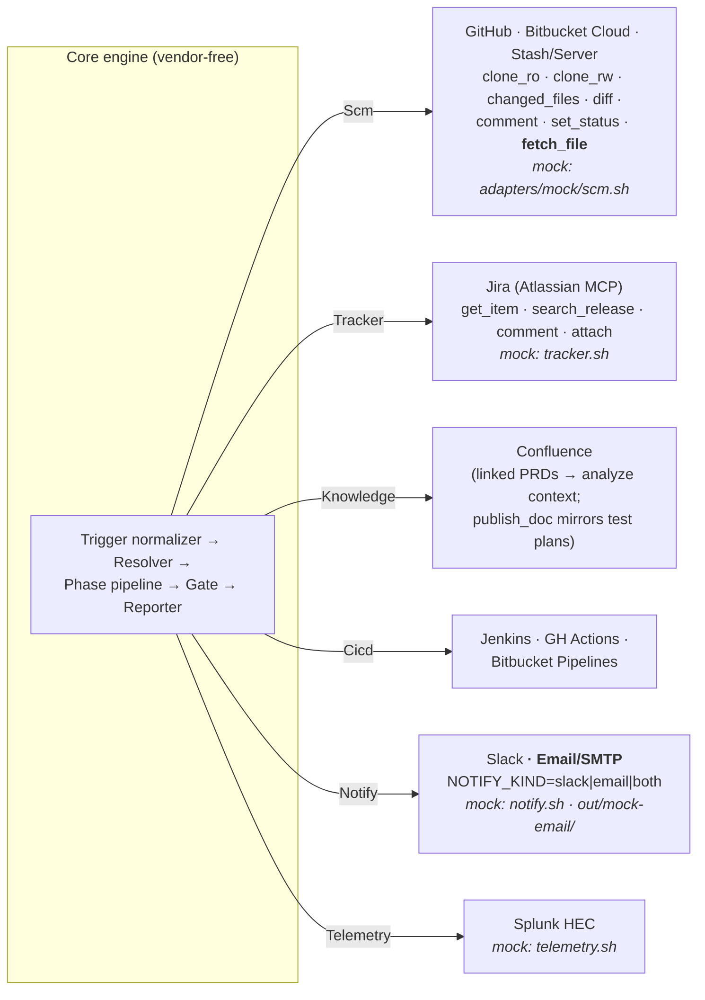
```mermaid
flowchart LR
    subgraph ENGINE["Core engine (vendor-free)"]
        P["Trigger normalizer → Resolver →<br/>Phase pipeline → Gate → Reporter"]
    end

    P -- Scm --> SCM["GitHub · Bitbucket Cloud · Stash/Server<br/>clone_ro · clone_rw · changed_files · diff ·<br/>comment · set_status · <b>fetch_file</b><br/><i>mock: adapters/mock/scm.sh</i>"]
    P -- Tracker --> TR["Jira (Atlassian MCP)<br/>get_item · search_release · comment · attach<br/><i>mock: tracker.sh</i>"]
    P -- Knowledge --> KN["Confluence<br/>(linked PRDs → analyze context;<br/>publish_doc mirrors test plans)"]
    P -- Cicd --> CI["Jenkins · GH Actions ·<br/>Bitbucket Pipelines"]
    P -- Notify --> NO["Slack <b>· Email/SMTP</b><br/>NOTIFY_KIND=slack|email|both<br/><i>mock: notify.sh · out/mock-email/</i>"]
    P -- Telemetry --> TE["Splunk HEC<br/><i>mock: telemetry.sh</i>"]
```

Every adapter — real or mock — answers the same verbs; unknown verbs exit 64
(`make conformance` enforces this). `AIQE_MOCK=1` swaps the whole right-hand column
for mocks without touching the engine.

## 3. Workflow A — PR-triggered test sync (§5.1)

```mermaid
sequenceDiagram
    participant Dev as Developer
    participant SCM as SCM (GitHub/BB)
    participant P as pipeline.sh
    participant RES as resolve.py
    participant LLM as Phases (triage→generate→validate→critic)
    participant ENV as with-env.sh
    participant G as gate.sh

    Dev->>SCM: open PR (label ai-tests)
    SCM->>P: webhook → pr <repo> <number>
    P->>SCM: changed_files + diff (the real patch hunks)
    P->>RES: changed files + registry
    RES-->>P: source_repos, test_repos, cross_repo_impact, confidence
    alt confidence below threshold
        P->>SCM: clarifying comment (candidates) — run ends
    end
    P->>P: clone src/ (read-only), tests/ (branch test/KEY-ai-qe)
    P->>P: refresh AGENTS.md + coverage gaps (surface with NO test)
    Note over P,LLM: budget guard BEFORE every phase (cost from out/cost.tsv +<br/>wall-clock vs org-config budgets / MAX_COST_USD_PER_RUN) —<br/>over limit → exit 77 BUDGET_EXCEEDED + notify, gate never runs
    P->>LLM: triage (diff + catalog slice + gaps) → generate specs + sidecar<br/>(+ existing-approach exemplars: real helper/spec code<br/>from the target repo — no new approach) → validate
    Note over P,LLM: ≥2 test repos resolved → generate FANS OUT: one agent per repo,<br/>each seeing ONLY its own conventions + confined to its own repo<br/>(merge_contracts.py merges back; a per-repo failure is contained)
    P->>LLM: critic (advisory quality score — read-only, never gates)
    par one gate per test repo (parallel)
        P->>G: gate.sh KEY repo
        G->>ENV: boot app-under-test (OS-assigned free port)
        ENV-->>G: BASE_URL exported
        G->>G: scope ✓ born-mapped ✓ lint ✓ run new specs ✓ secret scan ✓
        ENV-->>ENV: teardown (trap — guaranteed)
        G-->>P: GATE_STATUS=COMMITTED sha
    end
    P->>SCM: set_status: ai-qe success|failure on the PR head commit
    P->>SCM: coverage-delta PR comment (pr_comment.py): behaviors covered,<br/>created vs updated, validation, gate outcome, critic + cost —<br/>silent when triage finds no E2E impact
    Note over P: diff archived to reports/runs/ · review state → pending_review
```

## 4. Workflow B — JIRA-triggered test authoring (§5.2)

```mermaid
sequenceDiagram
    participant QE as QE Lead
    participant J as JIRA (Tracker port)
    participant C as Confluence (Knowledge port)
    participant P as pipeline.sh
    participant LLM as Phases
    participant G as gate.sh

    QE->>J: label ticket ai-test-gen
    J->>P: webhook → jira PROJ-301
    alt pasted JIRA context (no ticket)
        Note over P: AIQE_INLINE_FILE — qa.py run-inline /<br/>dashboard textarea synthesizes the ticket
    end
    P->>J: get_item → components, labels, linked repos, fixVersions, issue type
    P->>P: release captured (fixVersions) · issue-type guidance selected<br/>(story | bug regression | security negative-tests)
    P->>C: get_linked_docs (PRD page BODIES, budgeted, untrusted data)
    P->>P: resolve (component map + label restrictions, e.g. api-only)
    Note over P,LLM: budget guard before every phase (same as Workflow A) —<br/>over limit → exit 77 + notify
    P->>LLM: analyze (guidance + ticket + Confluence)
    P->>LLM: testplan (+ coverage gaps)
    P->>LLM: plan adversary (READ-ONLY: what did the author miss?)<br/>→ arbiter (judges each gap, ADDS accepted scenarios)<br/>non-fatal — a failure leaves the authored plan standing
    P->>LLM: testdata → generate<br/>(+ existing-approach exemplars — no new approach; fans out per repo) → validate
    P->>LLM: critic (advisory quality score — read-only, never gates)
    P->>G: parallel gates (same as Workflow A)
    G-->>P: GATE_STATUS per repo
    P->>J: comment: plan link, tests, per-repo status
    Note over P: + Slack summary · Splunk run record ·<br/>review state → pending_review (+ advisory critic score attached) ·<br/>plan exportable (pdf/docx/Confluence/JIRA attach)
```

## 5. The deterministic gate (§5.5)

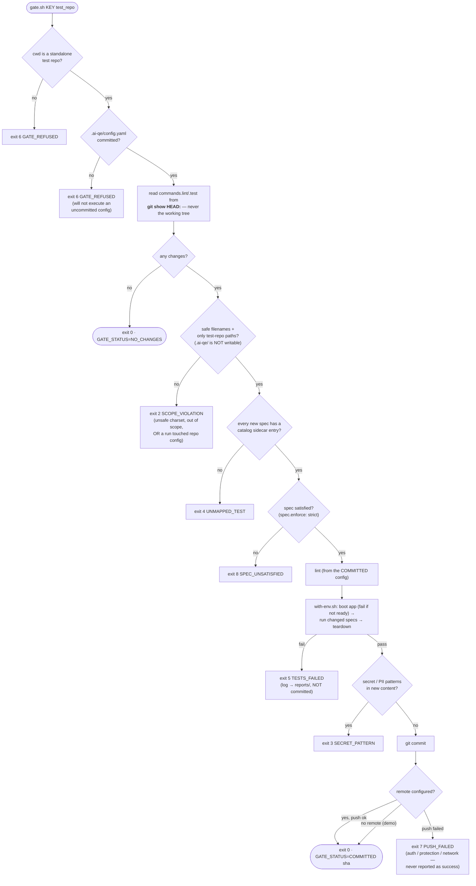
```mermaid
flowchart TD
    S([gate.sh KEY test_repo]) --> T6{cwd is a standalone<br/>test repo?}
    T6 -- no --> E6["exit 6 GATE_REFUSED"]
    T6 -- yes --> CFG{".ai-qe/config.yaml<br/>committed?"}
    CFG -- no --> E6b["exit 6 GATE_REFUSED<br/>(will not execute an<br/>uncommitted config)"]
    CFG -- yes --> RD["read commands.lint/.test from<br/><b>git show HEAD:</b> — never the working tree"]
    RD --> CH{any changes?}
    CH -- no --> OK0(["exit 0 · GATE_STATUS=NO_CHANGES"])
    CH -- yes --> T2{"safe filenames +<br/>only test-repo paths?<br/>(.ai-qe/ is NOT writable)"}
    T2 -- no --> E2["exit 2 SCOPE_VIOLATION<br/>(unsafe charset, out of scope,<br/>OR a run touched repo config)"]
    T2 -- yes --> T4{every new spec has a<br/>catalog sidecar entry?}
    T4 -- no --> E4["exit 4 UNMAPPED_TEST"]
    T4 -- yes --> SP{"spec satisfied?<br/>(spec.enforce: strict)"}
    SP -- no --> E8["exit 8 SPEC_UNSATISFIED"]
    SP -- yes --> L["lint (from the COMMITTED config)"]
    L --> RUN["with-env.sh: boot app (fail if not ready) →<br/>run changed specs → teardown"]
    RUN -- fail --> E5["exit 5 TESTS_FAILED<br/>(log → reports/, NOT committed)"]
    RUN -- pass --> T3{secret / PII patterns<br/>in new content?}
    T3 -- yes --> E3["exit 3 SECRET_PATTERN"]
    T3 -- no --> CP["git commit"]
    CP --> PUSH{remote configured?}
    PUSH -- yes, push ok --> OK(["exit 0 · GATE_STATUS=COMMITTED sha"])
    PUSH -- no remote (demo) --> OK
    PUSH -- push failed --> E7["exit 7 PUSH_FAILED<br/>(auth / protection / network —<br/>never reported as success)"]
```

All red paths quarantine the run for human inspection — never auto-retried. The
scope check rejects filenames outside a safe charset **before** any spec name is
interpolated into a shell command (the gate is the deterministic safety boundary).

**The two config steps are the trust boundary (§5.5.1).** The gate *executes*
`commands.{lint,test}`, so it must never read a version a run could have
written: `.ai-qe/` is off the writable scope, and the commands come from the
committed file. Either guard alone leaves a gap — without the scope removal the
gate would commit a malicious config and the *next* run would execute it.

Codes 2–5 are permanently regression-tested by `make test-gate` (6 attacks,
two of which pin exactly this: the rewrite is refused **and** the planted
command never runs).

## 6. Repo resolution — Phase 0 (§5.8.2)

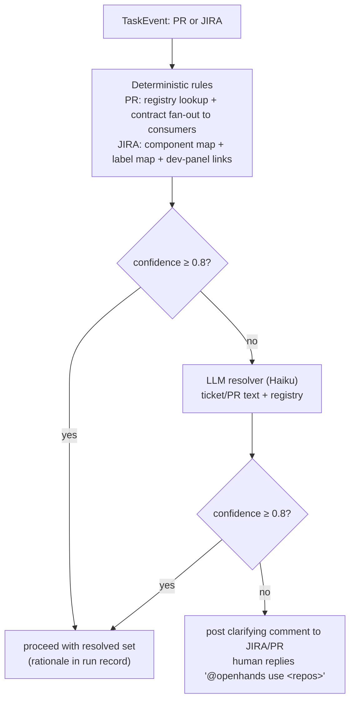
```mermaid
flowchart TD
    E[TaskEvent: PR or JIRA] --> RULES["Deterministic rules<br/>PR: registry lookup + contract fan-out to consumers<br/>JIRA: component map + label map + dev-panel links"]
    RULES --> CONF{confidence ≥ 0.8?}
    CONF -- yes --> GO["proceed with resolved set<br/>(rationale in run record)"]
    CONF -- no --> LLMR["LLM resolver (Haiku)<br/>ticket/PR text + registry"]
    LLMR --> CONF2{confidence ≥ 0.8?}
    CONF2 -- yes --> GO
    CONF2 -- no --> ASK["post clarifying comment to JIRA/PR<br/>human replies '@openhands use &lt;repos&gt;'"]
```

## 7. Catalog bootstrap (§5.9.2)

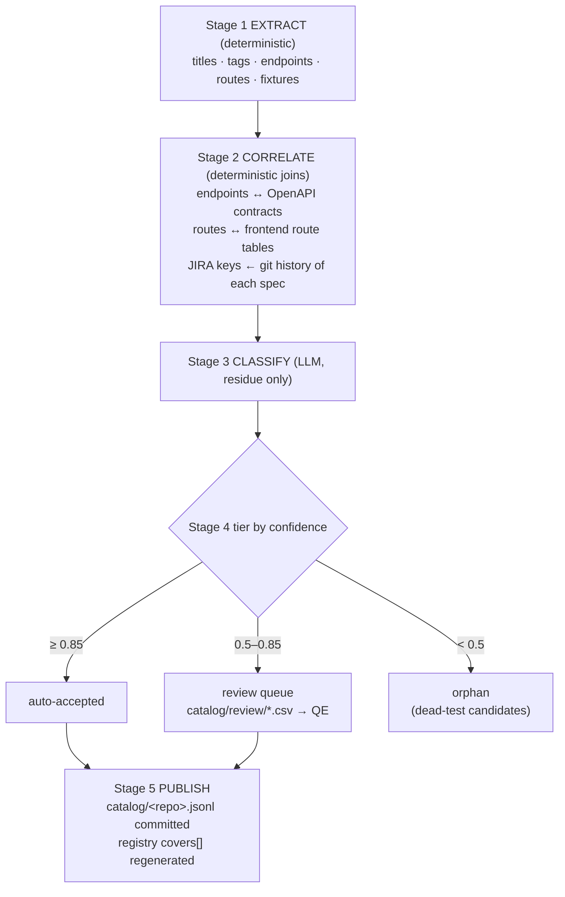
```mermaid
flowchart TD
    A["Stage 1 EXTRACT (deterministic)<br/>titles · tags · endpoints · routes · fixtures"]
    --> B["Stage 2 CORRELATE (deterministic joins)<br/>endpoints ↔ OpenAPI contracts<br/>routes ↔ frontend route tables<br/>JIRA keys ← git history of each spec"]
    --> C["Stage 3 CLASSIFY (LLM, residue only)"]
    --> D{"Stage 4 tier by confidence"}
    D -- "≥ 0.85" --> AUTO["auto-accepted"]
    D -- "0.5–0.85" --> REV["review queue<br/>catalog/review/*.csv → QE"]
    D -- "< 0.5" --> ORPH["orphan<br/>(dead-test candidates)"]
    AUTO --> PUB["Stage 5 PUBLISH<br/>catalog/&lt;repo&gt;.jsonl committed<br/>registry covers[] regenerated"]
    REV --> PUB
```

## 8. Workspace layout per run (§5.8.3)

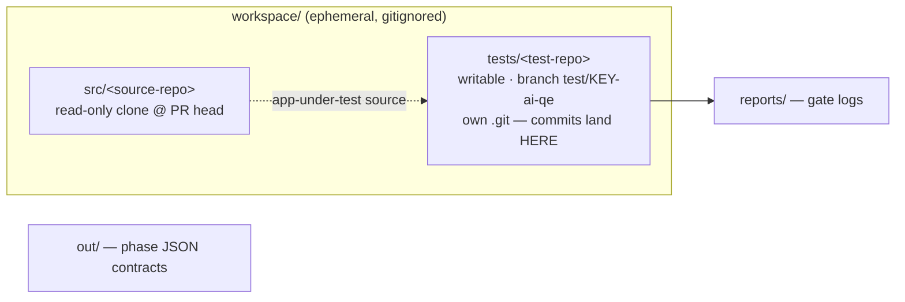
```mermaid
flowchart LR
    subgraph WS["workspace/ (ephemeral, gitignored)"]
        SRC["src/&lt;source-repo&gt;<br/>read-only clone @ PR head"]
        TST["tests/&lt;test-repo&gt;<br/>writable · branch test/KEY-ai-qe<br/>own .git — commits land HERE"]
    end
    OUT2["out/ — phase JSON contracts"]
    REP["reports/ — gate logs"]
    SRC -.->|app-under-test source| TST
    TST --> REP
```

The gate refuses (exit 6) to operate in any directory that resolves to the scaffold's
own repository — workspace clones are always independent git repos.

## 9. Estate knowledge & repository configuration

Every path that changes estate truth regenerates `AGENTS.md`, so LLM phases always
plan and generate against current facts:

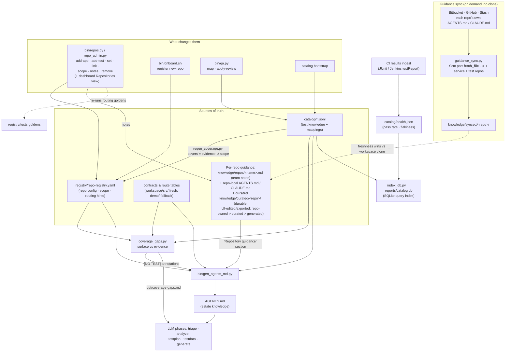
```mermaid
flowchart TD
    subgraph SOURCES["Sources of truth"]
        REG["registry/repo-registry.yaml<br/>(repo config · scope · routing hints)"]
        CAT["catalog/*.jsonl<br/>(test knowledge + mappings)"]
        ART["contracts & route tables<br/>(workspace/src/ fresh, demo/ fallback)"]
        GUI["Per-repo guidance:<br/>knowledge/repos/&lt;name&gt;.md (team notes)<br/>+ repo-local AGENTS.md / CLAUDE.md<br/>+ <b>curated</b> knowledge/curated/&lt;repo&gt;/ (durable,<br/>UI-edited/exported; repo-owned &gt; curated &gt; generated)"]
    end

    subgraph SYNC["Guidance sync (on demand, no clone)"]
        SCMR["Bitbucket · GitHub · Stash<br/>each repo's own AGENTS.md / CLAUDE.md"]
        GS["guidance_sync.py<br/>Scm port <b>fetch_file</b> · ui + service + test repos"]
        CACHE["knowledge/synced/&lt;repo&gt;/"]
        SCMR --> GS --> CACHE
    end
    CACHE -. "freshness wins vs workspace clone" .-> GUI

    subgraph WRITERS["What changes them"]
        RP["bin/repos.py / repo_admin.py<br/>add-app · add-test · set · link ·<br/>scope · notes · remove<br/>(+ dashboard Repositories view)"]
        OB["bin/onboard.sh<br/>register new repo"]
        QA["bin/qa.py<br/>map · apply-review"]
        BS["catalog bootstrap"]
    end

    CI["CI results ingest<br/>(JUnit / Jenkins testReport)"] --> HL["catalog/health.json<br/>(pass rate · flakiness)"]

    RP --> REG
    RP -- "notes" --> GUI
    OB --> REG
    QA --> CAT
    BS --> CAT
    CAT -- "regen_coverage.py:<br/>covers = evidence ∪ scope" --> REG

    REG --> GAPS["coverage_gaps.py<br/>surface vs evidence"]
    CAT --> GAPS
    ART --> GAPS
    REG --> GEN["bin/gen_agents_md.py"]
    CAT --> GEN
    ART --> GEN
    GUI -- "'Repository guidance' section" --> GEN
    GAPS -- "[NO TEST] annotations" --> GEN
    GEN --> AG["AGENTS.md<br/>(estate knowledge)"]
    AG --> PH["LLM phases: triage · analyze ·<br/>testplan · testdata · generate"]
    GAPS -- "out/coverage-gaps.md" --> PH
    CAT --> DB["index_db.py →<br/>reports/catalog.db<br/>(SQLite query index)"]
    HL --> DB
    RP -. "re-runs routing goldens" .-> GT["registry/tests goldens"]
```

Each E2E test repo carries a hand-managed **scope** (the app repos it is responsible
for — many app repos map to one test repo). `covers[]` stays generated as *catalog
evidence ∪ scope*, so a newly-mapped repo routes immediately, before any test evidence
exists, without ever hand-editing coverage. **Per-repo guidance** — team notes plus any
`AGENTS.md`/`CLAUDE.md` committed inside a repo's own checkout — is merged into
`AGENTS.md` and therefore steers every generation, test-plan, and coverage-gap phase.

## 10. QA monitoring, review & release tracking

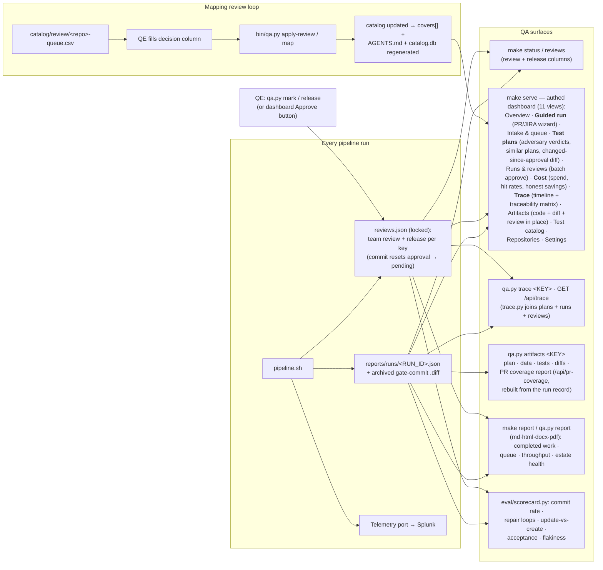
```mermaid
flowchart LR
    subgraph RUNTIME["Every pipeline run"]
        P["pipeline.sh"] --> RR["reports/runs/&lt;RUN_ID&gt;.json<br/>+ archived gate-commit .diff"]
        P --> RS["reviews.json (locked):<br/>team review + release per key<br/>(commit resets approval → pending)"]
        P --> TEL["Telemetry port → Splunk"]
    end

    subgraph SURFACES["QA surfaces"]
        ST["make status / reviews<br/>(review + release columns)"]
        DB["make serve — authed dashboard (11 views):<br/>Overview · <b>Guided run</b> (PR/JIRA wizard) ·<br/>Intake &amp; queue · <b>Test plans</b> (adversary verdicts,<br/>similar plans, changed-since-approval diff) ·<br/>Runs &amp; reviews (batch approve) · <b>Cost</b> (spend,<br/>hit rates, honest savings) · <b>Trace</b> (timeline +<br/>traceability matrix) · Artifacts (code + diff +<br/>review in place) · Test catalog ·<br/>Repositories · Settings"]
        TRC["qa.py trace &lt;KEY&gt; · GET /api/trace<br/>(trace.py joins plans + runs + reviews)"]
        AR["qa.py artifacts &lt;KEY&gt;<br/>plan · data · tests · diffs ·<br/>PR coverage report (/api/pr-coverage,<br/>rebuilt from the run record)"]
        REP["make report / qa.py report<br/>(md·html·docx·pdf): completed work ·<br/>queue · throughput · estate health"]
        SC["eval/scorecard.py: commit rate ·<br/>repair loops · update-vs-create ·<br/>acceptance · flakiness"]
    end

    RR --> ST
    RR --> DB
    RR --> TRC
    RS --> TRC
    RR --> AR
    RR --> REP
    RR --> SC
    RS --> ST
    RS --> DB
    RS --> REP
    RS --> SC
    TEAM["QE: qa.py mark / release<br/>(or dashboard Approve button)"] --> RS

    subgraph REVIEW["Mapping review loop"]
        Q1["catalog/review/&lt;repo&gt;-queue.csv"] --> Q2["QE fills decision column"]
        Q2 --> Q3["bin/qa.py apply-review / map"]
        Q3 --> Q4["catalog updated → covers[] +<br/>AGENTS.md + catalog.db regenerated"]
    end

    Q4 --> DB
```

## 11. Sharing the test plan

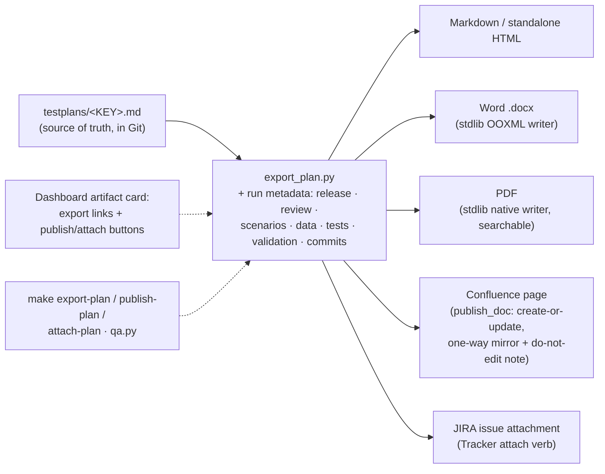
```mermaid
flowchart LR
    PLAN["testplans/&lt;KEY&gt;.md<br/>(source of truth, in Git)"] --> X["export_plan.py<br/>+ run metadata: release · review ·<br/>scenarios · data · tests · validation · commits"]
    X --> MD["Markdown / standalone HTML"]
    X --> DOCX["Word .docx<br/>(stdlib OOXML writer)"]
    X --> PDF["PDF<br/>(stdlib native writer, searchable)"]
    X --> CONF["Confluence page<br/>(publish_doc: create-or-update,<br/>one-way mirror + do-not-edit note)"]
    X --> ATT["JIRA issue attachment<br/>(Tracker attach verb)"]
    UI2["Dashboard artifact card:<br/>export links + publish/attach buttons"] -.-> X
    CLI["make export-plan / publish-plan /<br/>attach-plan · qa.py"] -.-> X
```

## 12. Team status report

One shareable document — for standups and release readouts — aggregated from state
the platform already keeps. Same stdlib renderers as the test-plan export.

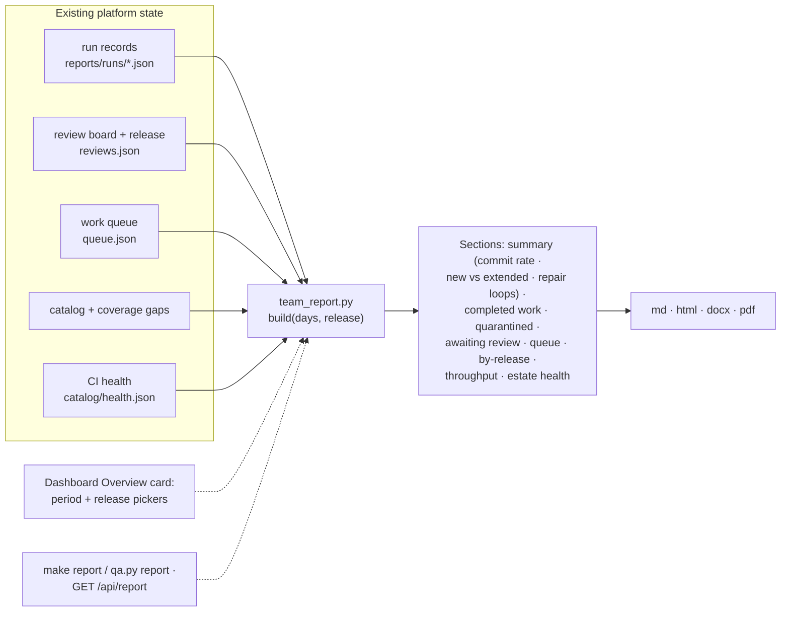
```mermaid
flowchart LR
    subgraph STATE["Existing platform state"]
        RR["run records<br/>reports/runs/*.json"]
        RVS["review board + release<br/>reviews.json"]
        Q2["work queue<br/>queue.json"]
        CT["catalog + coverage gaps"]
        HL2["CI health<br/>catalog/health.json"]
    end
    TR["team_report.py<br/>build(days, release)"]
    RR --> TR
    RVS --> TR
    Q2 --> TR
    CT --> TR
    HL2 --> TR
    TR --> SEC["Sections: summary (commit rate ·<br/>new vs extended · repair loops) ·<br/>completed work · quarantined ·<br/>awaiting review · queue · by-release ·<br/>throughput · estate health"]
    SEC --> OUT3["md · html · docx · pdf"]
    UI3["Dashboard Overview card:<br/>period + release pickers"] -.-> TR
    CLI2["make report / qa.py report ·<br/>GET /api/report"] -.-> TR
```

## 13. Configuration & estate management (dashboard)

Everything a QA lead configures lives in two dashboard views (plus CLI parity), so no
YAML or `.env` editing is required.

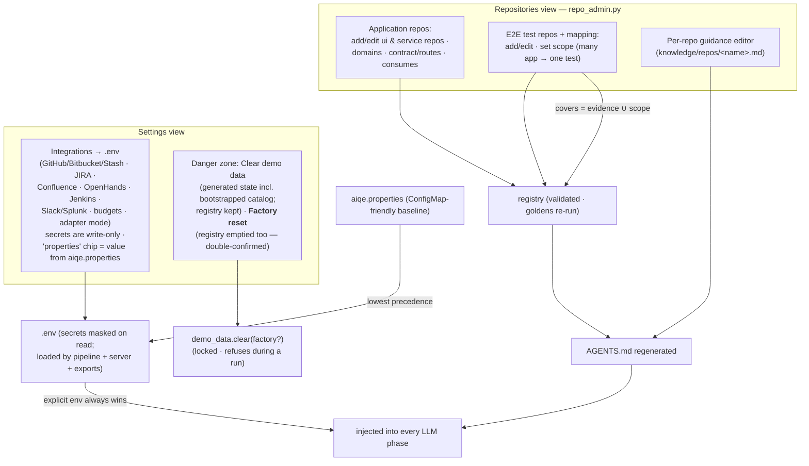
```mermaid
flowchart TD
    subgraph REPOSV["Repositories view — repo_admin.py"]
        A1["Application repos:<br/>add/edit ui &amp; service repos ·<br/>domains · contract/routes · consumes"]
        A2["E2E test repos + mapping:<br/>add/edit · set scope (many app → one test)"]
        A3["Per-repo guidance editor<br/>(knowledge/repos/&lt;name&gt;.md)"]
    end
    subgraph SETV["Settings view"]
        B1["Integrations → .env<br/>(GitHub/Bitbucket/Stash · JIRA ·<br/>Confluence · OpenHands · Jenkins ·<br/>Slack/Splunk · budgets · adapter mode)<br/>secrets are write-only ·<br/>'properties' chip = value from aiqe.properties"]
        B2["Danger zone: Clear demo data<br/>(generated state incl. bootstrapped catalog;<br/>registry kept) · <b>Factory reset</b><br/>(registry emptied too — double-confirmed)"]
    end
    A1 --> REG2["registry (validated · goldens re-run)"]
    A2 --> REG2
    A2 -- "covers = evidence ∪ scope" --> REG2
    A3 --> AG2["AGENTS.md regenerated"]
    REG2 --> AG2
    PROPS["aiqe.properties (ConfigMap-friendly baseline)"] -- "lowest precedence" --> ENV
    B1 --> ENV[".env (secrets masked on read;<br/>loaded by pipeline + server + exports)"]
    ENV -- "explicit env always wins" --> PH2
    B2 --> DEMO["demo_data.clear(factory?)<br/>(locked · refuses during a run)"]
    AG2 --> PH2["injected into every LLM phase"]
```

## 14. Plan-first workflow — human approval before generation (Workflow B variant)

`pipeline.sh jira` still runs plan→generate in one pass. When a team must sign off the
plan first, `pipeline.sh plan` stops after authoring and `pipeline.sh tests` resumes —
but only for an **approved** plan.

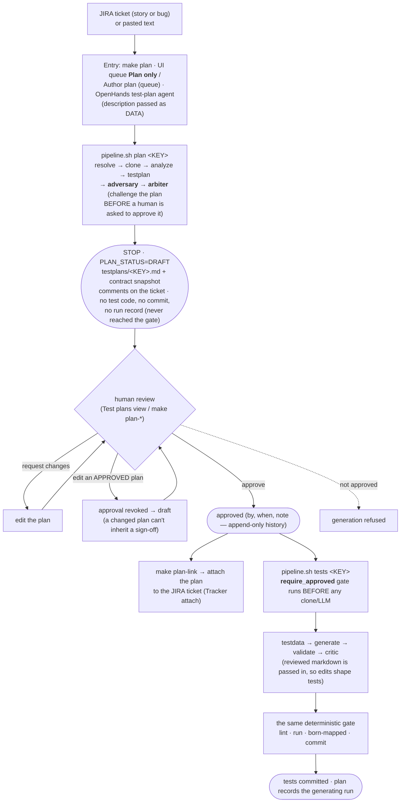
```mermaid
flowchart TD
    T["JIRA ticket (story or bug)<br/>or pasted text"] --> ENTRY["Entry: make plan · UI queue <b>Plan only</b> /<br/>Author plan (queue) · OpenHands test-plan agent<br/>(description passed as DATA)"] --> P1["pipeline.sh plan &lt;KEY&gt;<br/>resolve → clone → analyze → testplan<br/>→ <b>adversary → arbiter</b> (challenge the plan<br/>BEFORE a human is asked to approve it)"]
    P1 --> STOP(["STOP · PLAN_STATUS=DRAFT<br/>testplans/&lt;KEY&gt;.md + contract snapshot<br/>comments on the ticket · no test code, no commit,<br/>no run record (never reached the gate)"])
    STOP --> RV{"human review<br/>(Test plans view / make plan-*)"}
    RV -- "request changes" --> ED["edit the plan"]
    ED --> RV
    RV -- "edit an APPROVED plan" --> REVOKE["approval revoked → draft<br/>(a changed plan can't inherit a sign-off)"]
    REVOKE --> RV
    RV -- approve --> AP(["approved (by, when, note — append-only history)"])
    AP --> LINK["make plan-link → attach the plan<br/>to the JIRA ticket (Tracker attach)"]
    AP --> GEN["pipeline.sh tests &lt;KEY&gt;<br/><b>require_approved</b> gate runs BEFORE any clone/LLM"]
    GEN --> PH["testdata → generate → validate → critic<br/>(reviewed markdown is passed in, so edits shape tests)"]
    PH --> GATE["the same deterministic gate<br/>lint · run · born-mapped · commit"]
    GATE --> DONE(["tests committed · plan records the generating run"])
    RV -. "not approved" .-> BLOCK["generation refused"]
```

## 15. Deployment topology (local & OpenShift/Kubernetes)

Both services share filesystem state through an advisory lock, so they co-locate and
run as a single writer.

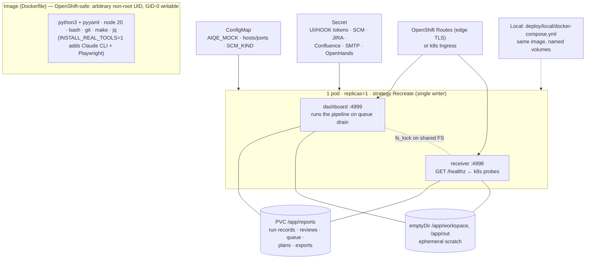
```mermaid
flowchart TB
    subgraph IMG["Image (Dockerfile) — OpenShift-safe: arbitrary non-root UID, GID-0 writable"]
        DEPS["python3 + pyyaml · node 20 · bash · git · make · jq<br/>(INSTALL_REAL_TOOLS=1 adds Claude CLI + Playwright)"]
    end

    subgraph POD["1 pod · replicas=1 · strategy Recreate (single writer)"]
        C1["dashboard :4999<br/>runs the pipeline on queue drain"]
        C2["receiver :4998<br/>GET /healthz ← k8s probes"]
    end

    PVC[("PVC /app/reports<br/>run records · reviews · queue ·<br/>plans · exports")]
    EPH[("emptyDir /app/workspace, /app/out<br/>ephemeral scratch")]
    C1 --- PVC
    C2 --- PVC
    C1 --- EPH
    C2 --- EPH
    C1 -. "fs_lock on shared FS" .- C2

    CM["ConfigMap<br/>AIQE_MOCK · hosts/ports · SCM_KIND"] --> POD
    SEC["Secret<br/>UI/HOOK tokens · SCM · JIRA ·<br/>Confluence · SMTP · OpenHands"] --> POD

    ROUTE["OpenShift Routes (edge TLS)<br/>or k8s Ingress"] --> C1
    ROUTE --> C2
    LOCAL["Local: deploy/local/docker-compose.yml<br/>same image, named volumes"] -.-> POD
```

## 16. Cost & retrieval stack (§5.13)

How a phase's context gets assembled and how spend is metered, capped and
reported. Every layer has a kill switch (Settings → Cost levers); judgement
phases and plan reuse stay on the conservative path until the parity-run
quality eval clears them.

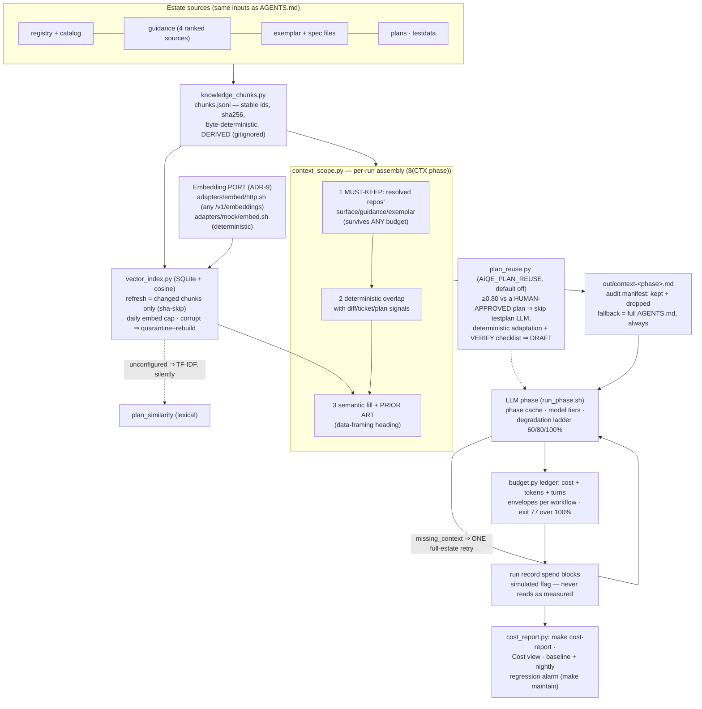
```mermaid
flowchart TB
    subgraph SRC["Estate sources (same inputs as AGENTS.md)"]
        REG["registry + catalog"] --- GUID["guidance (4 ranked sources)"]
        GUID --- EX["exemplar + spec files"] --- PLANS["plans · testdata"]
    end
    SRC --> KC["knowledge_chunks.py<br/>chunks.jsonl — stable ids, sha256,<br/>byte-deterministic, DERIVED (gitignored)"]
    KC --> VI["vector_index.py (SQLite + cosine)<br/>refresh = changed chunks only (sha-skip)<br/>daily embed cap · corrupt ⇒ quarantine+rebuild"]
    EMB["Embedding PORT (ADR-9)<br/>adapters/embed/http.sh (any /v1/embeddings)<br/>adapters/mock/embed.sh (deterministic)"] --> VI
    VI -. "unconfigured ⇒ TF-IDF, silently" .-> TFIDF["plan_similarity (lexical)"]

    subgraph ASM["context_scope.py — per-run assembly ($(CTX phase))"]
        T1["1 MUST-KEEP: resolved repos'<br/>surface/guidance/exemplar<br/>(survives ANY budget)"]
        T2["2 deterministic overlap<br/>with diff/ticket/plan signals"]
        T3["3 semantic fill + PRIOR ART<br/>(data-framing heading)"]
        T1 --> T2 --> T3
    end
    KC --> ASM
    VI --> T3
    ASM --> CTX["out/context-&lt;phase&gt;.md<br/>audit manifest: kept + dropped<br/>fallback = full AGENTS.md, always"]
    CTX --> PH["LLM phase (run_phase.sh)<br/>phase cache · model tiers ·<br/>degradation ladder 60/80/100%"]
    PH -- "missing_context ⇒ ONE full-estate retry" --> PH

    REUSE["plan_reuse.py (AIQE_PLAN_REUSE, default off)<br/>≥0.80 vs a HUMAN-APPROVED plan ⇒ skip testplan LLM,<br/>deterministic adaptation + VERIFY checklist ⇒ DRAFT"] -.-> PH

    PH --> SPEND["budget.py ledger: cost + tokens + turns<br/>envelopes per workflow · exit 77 over 100%"]
    SPEND --> REC["run record spend blocks<br/>simulated flag — never reads as measured"]
    REC --> RPT["cost_report.py: make cost-report ·<br/>Cost view · baseline + nightly<br/>regression alarm (make maintain)"]
```

## 17. LLM Runner port — provider independence (§5.14)

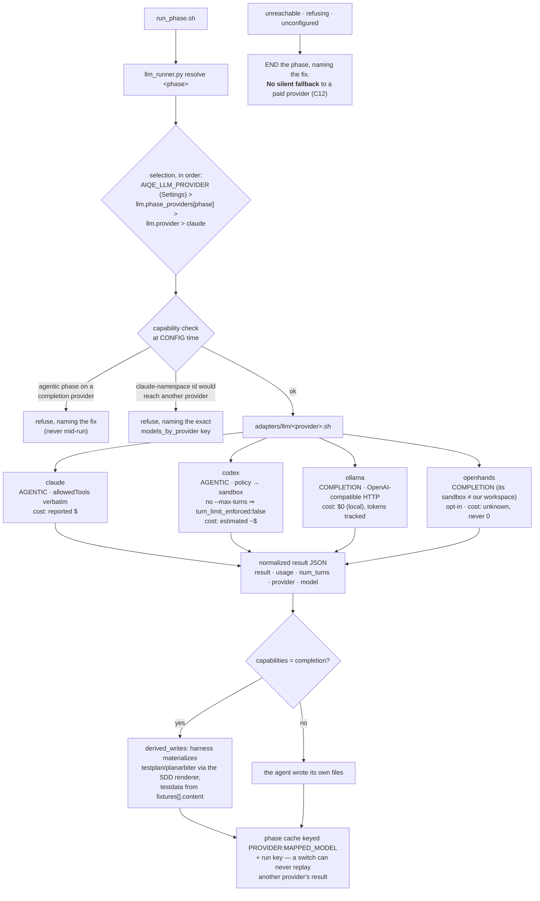
```mermaid
flowchart TD
    RP["run_phase.sh"] --> RES["llm_runner.py resolve &lt;phase&gt;"]
    RES --> SEL{"selection, in order:<br/>AIQE_LLM_PROVIDER (Settings) ><br/>llm.phase_providers[phase] ><br/>llm.provider > claude"}
    SEL --> CAP{"capability check<br/>at CONFIG time"}
    CAP -- "agentic phase on a<br/>completion provider" --> X1["refuse, naming the fix<br/>(never mid-run)"]
    CAP -- "claude-namespace id would<br/>reach another provider" --> X2["refuse, naming the exact<br/>models_by_provider key"]
    CAP -- ok --> AD["adapters/llm/&lt;provider&gt;.sh"]

    AD --> C["claude<br/>AGENTIC · allowedTools verbatim<br/>cost: reported $"]
    AD --> X["codex<br/>AGENTIC · policy → sandbox<br/>no --max-turns ⇒ turn_limit_enforced:false<br/>cost: estimated ~$"]
    AD --> O["ollama<br/>COMPLETION · OpenAI-compatible HTTP<br/>cost: $0 (local), tokens tracked"]
    AD --> H["openhands<br/>COMPLETION (its sandbox ≠ our workspace)<br/>opt-in · cost: unknown, never 0"]

    C & X & O & H --> NR["normalized result JSON<br/>result · usage · num_turns · provider · model"]
    NR --> DW{"capabilities = completion?"}
    DW -- yes --> MAT["derived_writes: harness materializes<br/>testplan/planarbiter via the SDD renderer,<br/>testdata from fixtures[].content"]
    DW -- no --> OWN["the agent wrote its own files"]
    MAT & OWN --> CACHE["phase cache keyed PROVIDER:MAPPED_MODEL<br/>+ run key — a switch can never replay<br/>another provider's result"]

    FAIL["unreachable · refusing · unconfigured"] --> STOP["END the phase, naming the fix.<br/><b>No silent fallback</b> to a paid provider (C12)"]
```

Every adapter also answers `tool_policy <allowed_tools>` — what it will
*actually* enforce — and conformance asserts the answer is never **more**
permissive than the policy. That is what stops a runtime which cannot express a
per-tool allow-list from quietly granting the critic or the plan adversary write
access, at which point "advisory" stops being true.

## 18. Attribution → routing: one chain, silent when wrong (§5.15)

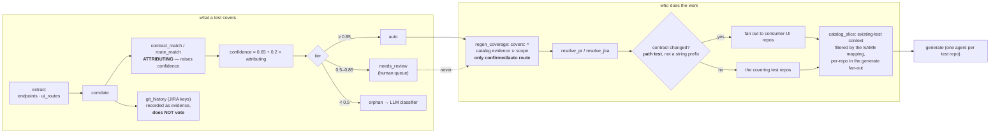
```mermaid
flowchart LR
    subgraph attribute["what a test covers"]
        EX["extract<br/>endpoints · ui_routes"] --> CO["correlate"]
        CO --> M1["contract_match / route_match<br/><b>ATTRIBUTING</b> — raises confidence"]
        CO --> M2["git_history (JIRA keys)<br/>recorded as evidence,<br/><b>does NOT vote</b>"]
        M1 --> CF["confidence = 0.65 + 0.2 × attributing"]
        CF --> ST{"tier"}
        ST -- "≥ 0.85" --> AUTO["auto"]
        ST -- "0.5–0.85" --> REV["needs_review<br/>(human queue)"]
        ST -- "< 0.5" --> ORPH["orphan → LLM classifier"]
    end

    AUTO --> COV["regen_coverage: covers: =<br/>catalog evidence ∪ scope<br/><b>only confirmed/auto route</b>"]
    REV -. never .-> COV

    subgraph route["who does the work"]
        COV --> RS["resolve_pr / resolve_jira"]
        RS --> FO{"contract changed?<br/><b>path test</b>, not a string prefix"}
        FO -- yes --> CON["fan out to consumer UI repos"]
        FO -- no --> ONE["the covering test repos"]
        CON & ONE --> SLICE["catalog_slice: existing-test context<br/>filtered by the SAME mapping,<br/>per-repo in the generate fan-out"]
    end

    SLICE --> GEN["generate (one agent per test repo)"]
```

Nothing in this chain errors when it is wrong. Tests get written, the gate
commits them, the run reports success — into the wrong repo, or not at all, and
the only symptom is coverage that quietly does not exist. `make test-routing-adv`
(11 attacks) exists because that class of failure is invisible to ordinary tests.

## 19. Observability: event → rule → channel (§5.17)

Every transaction lands in one append-only log. Rules ask that log questions on
the nightly tick; delivery goes through the Notify port. The dashed paths are
the honesty guarantees — the states that must never be reported as "fine".

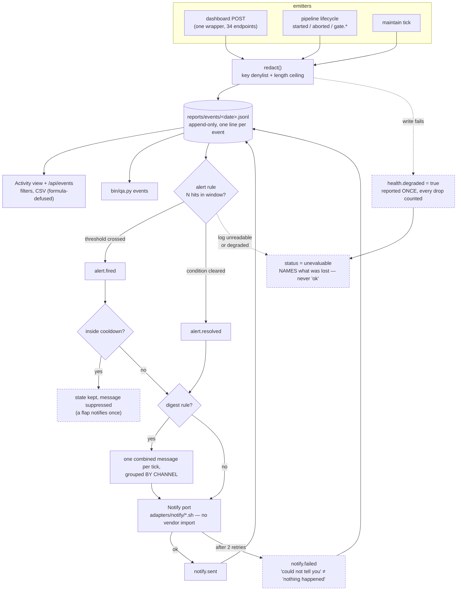
```mermaid
flowchart TD
  subgraph SRC["emitters"]
    UI["dashboard POST<br/>(one wrapper, 34 endpoints)"]
    PIPE["pipeline lifecycle<br/>started / aborted / gate.*"]
    CRON["maintain tick"]
  end
  UI --> RED["redact()<br/>key denylist + length ceiling"]
  PIPE --> RED
  CRON --> RED
  RED --> LOG[("reports/events/&lt;date&gt;.jsonl<br/>append-only, one line per event")]
  RED -.->|"write fails"| DEG["health.degraded = true<br/>reported ONCE, every drop counted"]

  LOG --> VIEW["Activity view + /api/events<br/>filters, CSV (formula-defused)"]
  LOG --> CLI["bin/qa.py events"]
  LOG --> EVAL{"alert rule<br/>N hits in window?"}

  EVAL -->|"threshold crossed"| FIRE["alert.fired"]
  EVAL -->|"condition cleared"| RES["alert.resolved"]
  EVAL -.->|"log unreadable<br/>or degraded"| UNEV["status = unevaluable<br/>NAMES what was lost — never 'ok'"]

  FIRE --> CD{"inside cooldown?"}
  CD -->|yes| HOLD["state kept, message suppressed<br/>(a flap notifies once)"]
  CD -->|no| DIG{"digest rule?"}
  RES --> DIG
  DIG -->|yes| BATCH["one combined message per tick,<br/>grouped BY CHANNEL"]
  DIG -->|no| SEND
  BATCH --> SEND["Notify port<br/>adapters/notify/*.sh — no vendor import"]
  SEND -->|"ok"| OKE["notify.sent"]
  SEND -->|"after 2 retries"| FAILE["notify.failed<br/>'could not tell you' ≠ 'nothing happened'"]
  OKE --> LOG
  FAILE --> LOG
  DEG --> UNEV

  classDef honest stroke-dasharray: 4 3;
  class DEG,UNEV,FAILE,HOLD honest;
```

**Test-fire skips the retry path entirely.** A human pressing Test wants to know
whether the channel works right now; a retry that hides a transient failure
defeats the purpose of testing.

## 20. The spec-driven workflow, and what actually enforces it (§5.18)

Six states per ticket. The dashed edges are the ones that only exist when
governance is turned **on** — which it is not by default. That is the whole
point of drawing it this way: with the gates off, every "refuses" below is
really "proceeds anyway, advisory", and a diagram that hid the difference would
teach a process the platform is not applying.

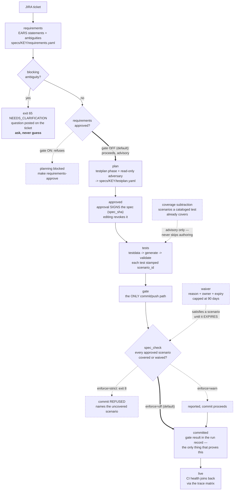
```mermaid
flowchart TD
  T["JIRA ticket"] --> REQ["requirements<br/>EARS statements + ambiguities<br/>specs/KEY/requirements.yaml"]

  REQ --> AMB{"blocking<br/>ambiguity?"}
  AMB -->|yes| STOP["exit 65 NEEDS_CLARIFICATION<br/>question posted on the ticket<br/><b>ask, never guess</b>"]
  AMB -->|no| RA{"requirements<br/>approved?"}

  RA -.->|"gate ON: refuses"| WAITR["planning blocked<br/>make requirements-approve"]
  RA ==>|"gate OFF (default):<br/>proceeds, advisory"| PLAN

  PLAN["plan<br/>testplan phase + read-only adversary<br/>-> specs/KEY/testplan.yaml"]
  PLAN --> APPR["approved<br/>approval SIGNS the spec (spec_sha)<br/>editing revokes it"]
  APPR --> TESTS["tests<br/>testdata -> generate -> validate<br/>each test stamped scenario_id"]
  TESTS --> GATE["gate<br/>the ONLY commit/push path"]

  GATE --> SC{"spec_check<br/>every approved scenario<br/>covered or waived?"}
  SC -.->|"enforce=strict: exit 8"| REFUSE["commit REFUSED<br/>names the uncovered scenario"]
  SC -.->|"enforce=warn"| WARN["reported, commit proceeds"]
  SC ==>|"enforce=off (default)"| COMMIT
  WARN --> COMMIT

  COMMIT["committed<br/>gate result in the run record —<br/>the only thing that proves this"] --> LIVE["live<br/>CI health joins back<br/>via the trace matrix"]

  WV["waiver<br/>reason + owner + expiry<br/>capped at 90 days"] -.->|"satisfies a scenario<br/>until it EXPIRES"| SC

  SUB["coverage subtraction<br/>scenarios a cataloged test<br/>already covers"] -.->|"advisory only —<br/>never skips authoring"| TESTS

  classDef off stroke-dasharray: 4 3;
  class RA,SC,WAITR,REFUSE,WARN,WV,SUB off;
```

**Read the two double arrows.** They are the default path: requirements approval
is not enforced and the spec check is off, so a ticket walks straight from
requirements to a commit without either gate having an opinion. Turning them on
is a two-step rollout — `warn` until the signal is clean, then `strict` —
because turning on `strict` first just teaches people to bypass the gate.

**Only one box proves a commit happened.** `committed` is read from the gate's
own per-repo result in the run record. Nothing else is evidence: the plan being
attached to the ticket is a different fact, and reading it as a commit is a bug
this diagram exists partly to prevent recurring.

## 21. The failure this platform kept making (constitution C13)

The defects below, found in one session, were all one defect. Each time, the system could
not establish a fact and returned a plausible answer instead of saying so — and
the plausible answer was always the SAFE-LOOKING one, which is what made it
invisible. `off`, `False`, "no growth" and `$0` all read as decisions somebody
made rather than as questions nobody answered.

```mermaid
flowchart TD
  Q["a question with a real answer<br/>did the tests pass? · is enforcement on?<br/>· was the alarm delivered? · what did it cost?"]

  Q --> TRY{"could we<br/>establish it?"}

  TRY -->|yes| REAL["report what is true<br/>passed / failed · on / off · $12.40"]

  TRY -->|"no — clone failed, channel down,<br/>value unparsable, nothing metered"| WRONG
  TRY -->|"no"| RIGHT

  WRONG["<b>WHAT IT DID</b><br/>pick the safe-LOOKING answer<br/>False · off · no growth · $0"]
  RIGHT["<b>WHAT C13 REQUIRES</b><br/>a THIRD state, plus the fix<br/>None · unverifiable · unevaluable · unknown"]

  WRONG --> HARM["reader acts on a fact<br/>nobody established<br/><br/>hunts a regression in tests that never ran ·<br/>believes the gate is enforcing · reads silence<br/>as health · repeats a $0 that was never measured"]

  RIGHT --> GOOD["reader learns what is MISSING<br/>and what to do about it<br/><br/>'clone_ro failed' · 'stict is not a mode' ·<br/>'baseline NOT advanced' · 'run make parity-jira'"]

  classDef bad stroke-dasharray: 4 3;
  class WRONG,HARM bad;
```

**Each one, and what it said instead of "I don't know":**

| Where | Said | Truth |
|---|---|---|
| Waiver on a missing scenario | "44d left" | matched nothing |
| `AIQE_SPEC_ENFORCE=stict` | `off` | value unusable |
| `spec.enforce: off` (YAML) | boolean `False` | not the string it looks like |
| `AIQE_REQUIREMENTS_GATE=enabled` | gate off | value unusable |
| `NOTIFY_KIND=emails` | delivered via slack | channel not the one configured |
| Coverage drift, channel down | "no growth" next run | alarm never delivered |
| `spec_verify`, clone failed | `passed: False` | nothing ran |
| `AIQE_MOCK=true` / `AIQE_GATE_CHECK_ONLY=true` | real adapters / a real commit | somebody asked for the dry run |
| `{"factory": "false"}` | a factory reset | a caller saying *not* to |
| `run_record`, torn TSV line | the whole record lost | one line was partial |
| `spec_drift`, channel down | "no drift" next run | the alarm was never delivered |
| `vector_index._notify_once` | "notified today" | the send failed |
| `budget`, unwritable ledger | `enforced`, `$0.00` spent | $25.00 spent, uncountable |
| `tier.py` classifier output | no classifications at all | a bracketed aside broke the parse |
| bare `os.replace` (9 sites) | the write succeeded | Windows discarded it |
| `harvest_facts`, no app repos | every test `orphan`, `covers: []` | no contract was ever read |
| `repo_admin`, relocated catalog | "0 cataloged tests" → removal allowed | the catalog was elsewhere |
| Stage 0b, empty `workspace/src/x` | a usable checkout, clone skipped | the directory was empty |
| `slack.sh`, no webhook configured | `SLACK_WEBHOOK_URL: unbound variable` | Slack is simply not configured |
| First boot, empty state root | "already populated - nothing seeded" | it had just created it, empty |

**The direction is the design decision, not the third state.** Both mock-mode
knobs resolve an unusable value toward "wrote nothing" — but that means MOCK for
`AIQE_MOCK` and CHECK-ONLY for `AIQE_GATE_CHECK_ONLY`, which are opposite
literal values. The rule is not "default to false"; it is *default to the
outcome you can recover from by running it again*.

**Where it was already right.** §5.17's alerting (`unevaluable` is never `ok`)
and §5.12's cost bases (`unknown` is never `$0`) reached this independently,
which is why C13 was promoted from a habit to a clause rather than invented.

### The sub-pattern that produced four of them

Four modules independently wrote "notify once per change", and three got it
wrong the same way:

```mermaid
flowchart LR
  D["a change worth reporting"] --> W

  subgraph WRONG["what three of them did"]
    W["record the change"] --> N1["send"] --> L["send fails —<br/>and the change is<br/>already recorded"]
    L --> Q["next run sees NO change<br/>-> never retries"]
  end

  D --> R
  subgraph RIGHT["what C13 requires"]
    R["send"] --> OK{"delivered?"}
    OK -->|yes| REC["record the change"]
    OK -->|no| KEEP["leave the old state —<br/>next run reports it again"]
  end

  classDef bad stroke-dasharray: 4 3;
  class W,N1,L,Q bad;
```

**The dedup key and the delivery receipt are not the same fact.** Recording the
change is what stops a nightly job re-alarming forever; it is also what stops it
retrying. They look identical until the channel is down, which is exactly when
the alarm matters.

`alert_rules` is the one that got it right, and the only one designed with this
in mind: firing is a STATE that resolves, and it records `notify.sent` /
`notify.failed` separately. The other three were each written as a one-line
"have we already said this?" check.
